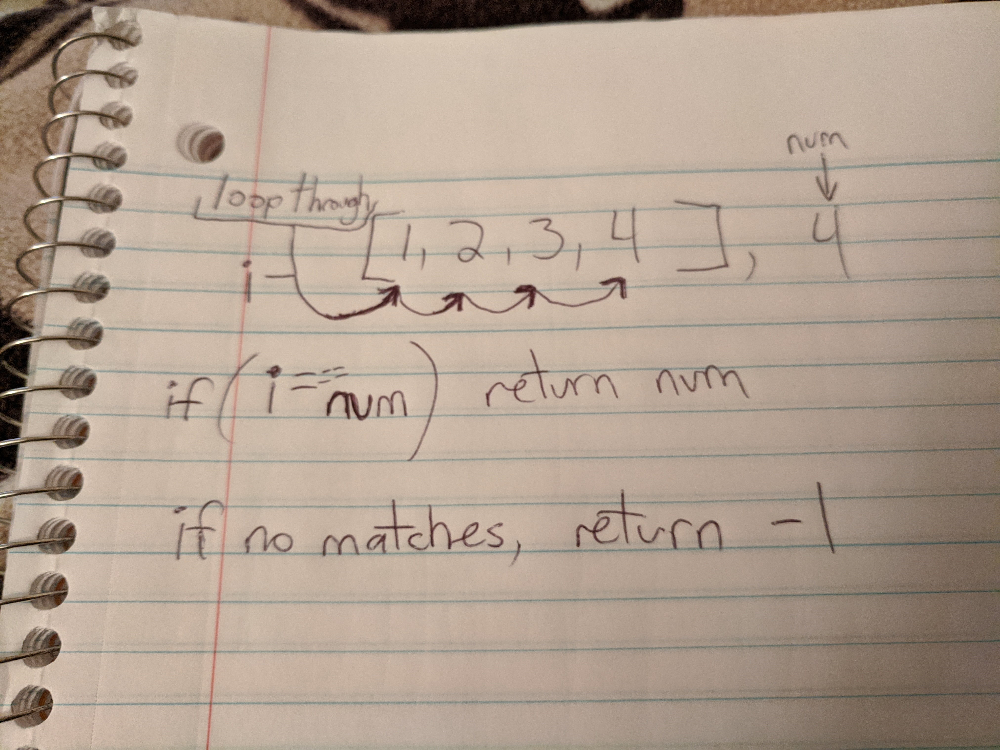
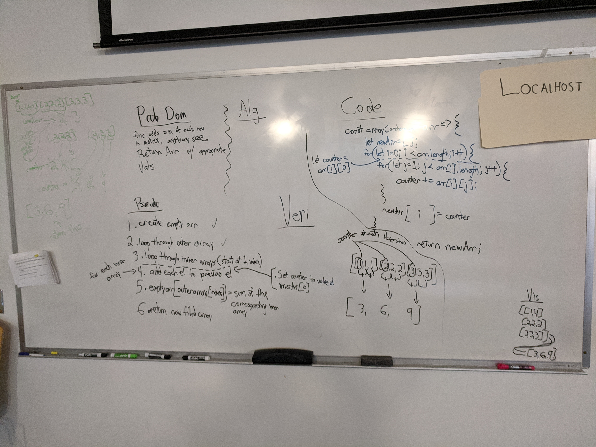

## Table of Contents

1. arrayReverse - PR: https://github.com/TravelFiend/data-structures-and-algorithms/pull/1
1. arrayShift - PR: https://github.com/TravelFiend/data-structures-and-algorithms/pull/2
1. arrayBinarySearch - PR: https://github.com/TravelFiend/data-structures-and-algorithms/pull/3
1. mockInterview - N/A
1. linkedList - PR: https://github.com/TravelFiend/data-structures-and-algorithms/pull/5
1. llInsertions - PR: https://github.com/TravelFiend/data-structures-and-algorithms/pull/6
1. llKthFromEnd - PR: https://github.com/TravelFiend/data-structures-and-algorithms/pull/8

# Reverse an Array
<!-- Short summary or background information -->
First of many code challenges in career track. Completed by Mike Grace

## Challenge
<!-- Description of the challenge -->
Reverse an array without using any of Javascript's built in methods

## Approach & Efficiency
<!-- What approach did you take? Why? What is the Big O space/time for this approach? -->
For this challenge I decided to do the following:

1. set a variable to an empty array
2. set another variable to 0
3. loop backwards through the argument array
4. set the index (chosen by our set variable) of our empty array to be equal to the value of the argument array at current iteration
5. return our new array

## Solution
<!-- Embedded whiteboard image -->
~~~~
const reverseArray = arr => {
    let newArr = [];
    let newArrIndex = 0;
    for(let i = arr.length - 1; i >= 0; i--) {
        newArr[newArrIndex] = arr[i];
        newArrIndex++;
    }
    return newArr;
};
~~~~

# Shift an Array
<!-- Short summary or background information -->
Second code chalenge in career track. Completed by Mike Grace

## Challenge
<!-- Description of the challenge -->
Splice a value into the middle of an array without using any of Javascript's built in methods

## Approach & Efficiency
<!-- What approach did you take? Why? What is the Big O space/time for this approach? -->
For this challenge I went with the following approach:

1. set variable to halfway of arr.length
1. set variable to 0
1. set variable to empty array
1. loop through array up to halfway point
1. A - set 0 index of new array to arr[i]
1. B - increment 0 variable by 1 for each iteration
1. add number argument to array at halfway point
1. loop through array from halfway to arr.length
1. reapeat steps "A" and "B" except for "A", start at halway point and for "B", increment halfway variable
1. return new array

## Solution
<!-- Embedded whiteboard image -->
[logo]: ./assets/array-shift-whiteboard.jpg
![logo]
~~~~
const insertShiftArray = (arr, num) => {
    const newArr = [];
    let half = Math.ceil(arr.length / 2);
    let startIndex = 0;

    for(let i = 0; i < half; i++) {
        newArr[startIndex] = arr[i];
        startIndex++;
    }

    newArr[half] = num;

    for(let j = half; j < arr.length; j++) {
        newArr[half + 1] = arr[j];
        half++;
    }

    return newArr;
};
~~~~

# Array Binary Search
<!-- Short summary or background information -->
Third code chalenge in career track. Completed by Mike Grace

## Challenge
<!-- Description of the challenge -->
Return the index of the array’s element that is equal to the search key, or -1 if the element does not exist

## Approach & Efficiency
<!-- What approach did you take? Why? What is the Big O space/time for this approach? -->
For this challenge I decided to do the following:

1. Loop through the array
1. Check if the value at each index equals the search key
1. If so, return the index where it was found
1. If not, return -1

## Solution
<!-- Embedded whiteboard image -->

~~~~
const binarySearch = (sortedArr, searchKey) => {
    for(let i = 0; i < sortedArr.length; i++) {
        if(sortedArr[i] === searchKey) {
            return i;
        }
    }
    return -1;
};
~~~~

# Mock Interview
<!-- Short summary or background information -->
Fourth code chalenge in career track. Completed by Mike Grace

## Challenge
<!-- Description of the challenge -->
Write a function to add up the sum of each row in a matrix of arbitrary size, and return an array with the appropriate values.

## Approach & Efficiency
<!-- What approach did you take? Why? What is the Big O space/time for this approach? -->
For this challenge I decided to do the following:

1. Create an empty array
1. Loop through outer array
1. Create counter variable and set it to zero index of inner array
1. Loop through inner arrays (starting and index 1)
1. For each inner array, add each element to counter
1. Set index of outer array to new counter value
1. Return new arr

## Solution
<!-- Embedded whiteboard image -->

~~~~
const arrayCondenser = arr => {
    const newArr = [];
    for(let i = 0; i < arr.length; i++){
        let counter = arr[i][0];
        for(let j = 1; j < arr[i].length; j++) {
            counter += arr[i][j];
        }
        newArr[i] = counter;
    }
    return newArr;
};
~~~~

# Linked List
<!-- Short summary or background information -->
Fifth code chalenge in career track. Completed by Mike Grace

## Challenge
<!-- Description of the challenge -->
Create a Node class that has properties for the value stored in the Node, and a pointer to the next Node.
Within your LinkedList class, include a head property. Upon instantiation, an empty Linked List should be created.
* Define a method called insert which takes any value as an argument and adds a new node with that value to the head of the list with an O(1) Time performance.
* Define a method called includes which takes any value as an argument and returns a boolean result depending on whether that value exists as a Node’s value somewhere within the list.
* Define a method called toString (or __str__ in Python) which takes in no arguments and returns a string representing all the values in the Linked List.

## Approach & Efficiency
<!-- What approach did you take? Why? What is the Big O space/time for this approach? -->
For this challenge I decided to do the following:

1. 

## Solution
<!-- Embedded whiteboard image -->

~~~~
class Node {
    constructor(value){
        this.value = value;
        this.next = null;
    }
}

class LinkedList {
    constructor() {
        this.head = null;
    }

    insert(val) {
        const node = new Node(val);
        node.next = this.head;
        this.head = node;
    }

    includes(val) {
        let current = this.head;
        while(current !== null) {
            if(current.value === val) {
                return true;
            }
            current = current.next;
        }
        return false;
    }

    toString() {
        let str = '';
        let current = this.head;
        while(current !== null) {
            str += `${current.value} `;
            current = current.next;
        }
        return str;
    }
}
~~~~

# Linked List Insertions
<!-- Short summary or background information -->
Sixth code chalenge in career track. Completed by Mike Grace

## Challenge
<!-- Description of the challenge -->
Write the following methods for the Linked List class:

* .append(value) which adds a new node with the given value to the end of the list
* .insertBefore(value, newVal) which add a new node with the given newValue immediately before the first value node
* .insertAfter(value, newVal) which add a new node with the given newValue immediately after the first value node

## Approach & Efficiency
<!-- What approach did you take? Why? What is the Big O space/time for this approach? -->
For this challenge I decided to do the following:

1. 

## Solution
<!-- Embedded whiteboard image -->
~~~~

~~~~

# Linked List Kth From End
<!-- Short summary or background information -->
Seventh code chalenge in career track. Completed by Mike Grace

## Challenge
<!-- Description of the challenge -->
Write a method for the Linked List class which takes a number, k, as a parameter. Return the node’s value that is k from the end of the linked list.

## Approach & Efficiency
<!-- What approach did you take? Why? What is the Big O space/time for this approach? -->
For this challenge I decided to do the following:

1. find full length of linked list
1. subtract k from full length
1. after getting the difference, find corresponding linked list node
1. return that node's value

## Solution
<!-- Embedded whiteboard image -->

~~~~
kthFromEnd(k) {
    let current = this.head;
    let totalNodes = 0;
    while(current){
        totalNodes++;
        current = current.next;
    }
    const place = totalNodes - k;
    let num = 1;
    current = this.head;
    while(current){
        if(num !== place){
            num++;
            current = current.next;
        } else {
            return current.value;
        }
    }
}
~~~~