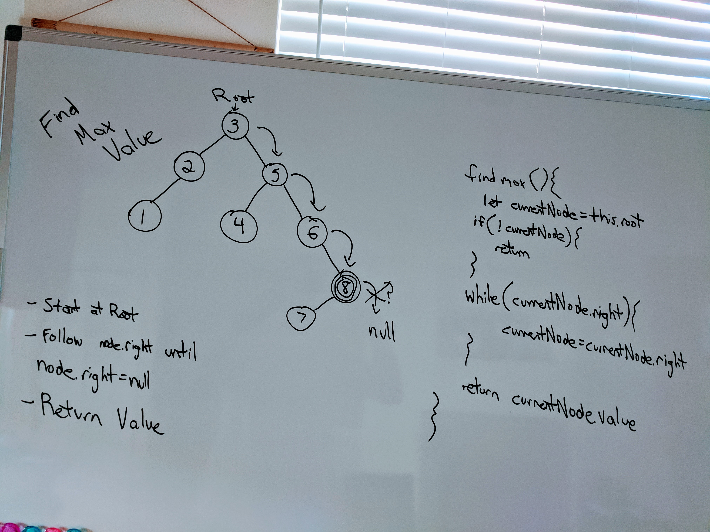

# Find Maximum Binary Tree
<!-- Short summary or background information -->
Class 18 code challenge of career track. Completed by Mike Grace

## Challenge
<!-- Description of the challenge -->
Write an instance method called find-maximum-value. Without utilizing any of the built-in methods available to your language, return the maximum value stored in the tree. You can assume that the values stored in the Binary Tree will be numeric.

## Approach & Efficiency
<!-- What approach did you take? Why? What is the Big O space/time for this approach? -->
For this challenge I decided to do the following:

1. Start at tree's root
2. Set current node to tree's root
3. CurrentNode equals currentNode.right until there is no more currentNode.right.
4. Return Value

## Solution

~~~~
findMaximumValue(){
  let currentNode = this.root;
  if (currentNode) {
    return;
  }
  while(currentNode.right){
    currentNode = currentNode.right;
  }
  return currentNode.data;
}
~~~~